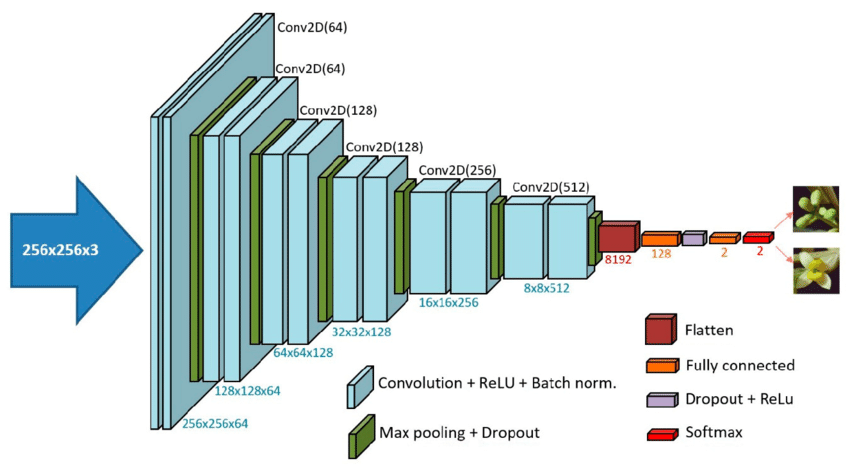
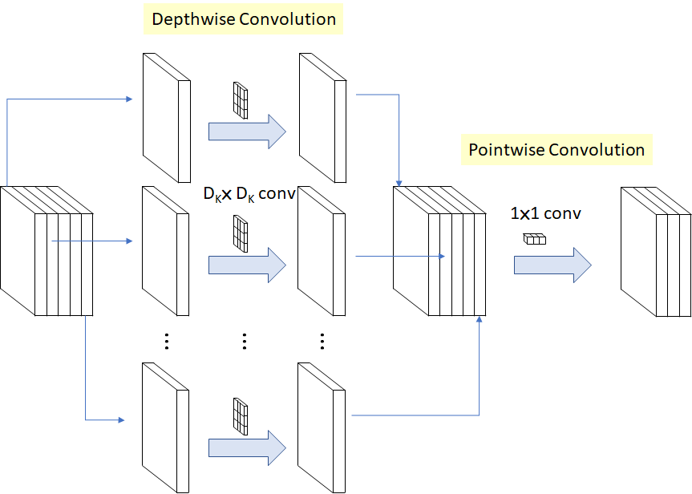
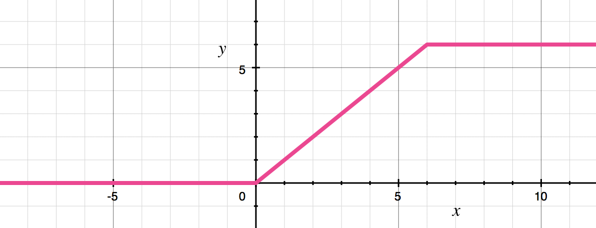

# MobileNetV1 분석 및 이해

# 개요

- MobileNet이란?
    - 모바일/임베디드 기기를 위한 경량화된 CNN 모델
    - 낮은 연산량과 파라미터 수로 높은 효율성 달성
    - 주요 적용 분야: 실시간 이미지 분류, 객체 탐지 등
- 프로젝트와의 연관성
    
    우리 프로젝트의 목표는 **기상 악화 조건에서도 강인하게 작동하는 실시간 자율주행 객체 탐지 모델**을 개발하는 것이다. 
    
    특히, 이 모델은 **라즈베리파이 4**와 같은 제한된 컴퓨팅 자원을 가진 환경에서 동작해야 하므로, **경량화**되고 빠른 처리 속도(높은 FPS)를 가지면서도 **정확도**를 유지하는 것이 핵심이다.
    
    ---
    
    ## **왜 MobileNetV1을 공부하는가?**
    
    1. **경량화 원리 이해:** MobileNetV1은 **Depthwise Separable Convolution**이라는 혁신적인 기법을 통해 모델의 파라미터 수와 연산량(FLOPs)을 획기적으로 줄여 경량화를 달성한 대표적인 모델이다.
        
        라즈베리파이와 같은 임베디드 환경에서 모델을 효율적으로 실행하기 위한 핵심 원리를 이해하는 데 필수적이다.
        
    2. **실시간 처리의 기반:** MobileNetV1의 낮은 연산량은 높은 FPS(Frames Per Second)로 이어져, 실시간 영상 입력에 대한 빠른 객체 탐지를 가능하게 한다.
        
        우리 프로젝트의 실시간성 요구 조건(real-time capability)을 만족시키기 위한 기반 기술을 배우는 것이다.
        
    3. **객체 탐지 모델의 백본(Backbone) 활용:** 
        
        MobileNetV1 자체는 이미지 분류 모델이지만, 그 효율적인 아키텍처는 SSD(Single Shot Detector), YOLO 등 다양한 객체 탐지 모델의 특징 추출기 즉, 백본 네트워크로 널리 활용된다.
        
    4. **성능 트레이드오프 이해:** 
        
        MobileNetV1의 하이퍼파라미터(Width Multiplier, Resolution Multiplier)를 통해 모델 크기/속도와 정확도 간의 트레이드오프를 어떻게 조절하는지 학습함으로써, 
        
        우리 프로젝트의 특정 요구사항(예: 라즈베리파이 성능 제약)에 맞춰 모델을 최적화하는 방법을 배울 수 있다.
        

# 핵심 기술

---

- **기존 Standard Convolution**
    
    
    
    
    기존 CNN에서는 필터 하나가 입력 데이터의 **가로, 세로(공간적 차원) 정보와 깊이(채널 차원) 정보를 한 번에 처리한다.**
    
    예를 들어, 3x3 크기의 필터를 3채널(RGB) 이미지에 적용할 때, 필터는 실제로는 3x3x3의 크기를 가진다. 이 필터가 이미지 위를 이동하면서 각 위치에서 3채널의 정보를 **모두 종합**하여 하나의 출력 값을 만든다.
    
    즉, 공간적인 특징을 추출하는 것과 채널 간의 특징을 결합하는 것이 **동시에** 이루어진다.
    
    이 방식은 입력 채널 수와 출력 채널 수가 많아질수록, 필터 크기가 커질수록 **계산량(Multiply-Accumulates, MACs)과 파라미터(가중치) 수가 기하급수적으로 증가한다.**
    
    예를 들어, 32개의 입력 채널을 받아 64개의 출력 채널을 만드는 3x3 표준 컨볼루션은 3x3x32x64 = 18,432 개의 파라미터가 필요하다.
    
    이는 특히 모바일이나 임베디드 기기처럼 리소스가 제한된 환경에서는 큰 부담이 된다.
    

---

## Depthwise Separable Convolution(깊이별 분리 합성곱)

### **1단계:** **공간 필터링 (Spatial Filtering) → Depthwise Convolution**

- 각 입력 채널에 대해 **공간적인 패턴(모양, 질감 등)만 독립적으로 추출한다**.
- 이 단계에서는 **채널 간의 정보를 섞지 않는다.**

**작동 방식:**

- 입력 특징 맵이 M개의 채널을 가지고 있다면, M개의 독립적인 공간 필터(예: 3x3 크기)를 사용.
- **각 필터는 오직 하나의 입력 채널에만 적용된다**. 즉, 첫 번째 필터는 첫 번째 채널만 보고, 두 번째 필터는 두 번째 채널만 보는 식이다.
- 각 필터는 해당 채널 위를 이동하면서 공간적인 특징을 추출하여 하나의 출력 채널(특징 지도)을 만든다.
- 따라서 입력 채널 수가 M개이면, Depthwise Convolution의 출력 채널 수도 **똑같이 M개.** 공간적 필터링만 수행하고 채널 수는 그대로 유지.

**연산량:**

$D_K^2 \times (\alpha M) \times (\rho D_F)^2$

1. 3×3 필터 하나를 쓰면 곱셈·덧셈 9번이 필요하므로 $D_K^2$
2. **그걸 채널마다** ( $αM$개) **반복**.
3. **이미지의 모든 위치** ($(\rho D_F)^2$픽셀)마다 적용.만

→ “필터 크기 × 채널 수 × 이미지 해상도” 만큼 연산

**결과:** 

각 채널별로 공간적 특징이 강조된 M개의 특징 지도가 생성된다. 하지만 아직 채널 간의 관계는 고려되지 않음.

---

### **2단계: 채널 결합 (Channel Combination) → Pointwise Convolution**

- Depthwise Convolution에서 나온 M개의 채널 정보를 **선형적으로 결합(섞어주어) 새로운 특징 표현을 만들고, 동시에 출력 채널의 수를 조절한다.**

**작동 방식:**

- **1x1 크기의 컨볼루션 필터 사용.** 이 필터는 공간적 크기는 1x1이지만, 깊이(채널 수)는 Depthwise 단계의 출력 채널 수와 같은 M개이다.
- 만약 N개의 출력 채널을 만들고 싶다면, 이러한 1x1xM **크기의 필터를 N개 사용한다.**
- 각  1x1xM 필터는 입력 특징 맵의 한 위치(1x1)에서 **모든 M개 채널의 값을 한 번에 보고** 가중합(weighted sum)을 계산하여 **하나의 출력 값**을 만든다.
- N개의 필터가 각각 다른 방식으로 채널 정보를 조합하여, 최종적으로 N**개의 채널을 가진 출력 특징 맵**을 생성한다.

연산량:

$(αM)×(αN)×(\rho D_F)^2$

1. **1×1 필터**라 곱셈·덧셈 개수는 필터 크기 무시(=1).
2. **입력 채널  $αM$** 개의 값을
3. **출력 채널 $αN$** 개로 섞어서
4. **이미지의 모든 위치** ($(\rho D_F)^2$픽셀)마다 수행.

→ “입력 채널 수 × 출력 채널 수 × 이미지 해상도” 만큼 연산

**이 분리된 접근 방식 덕분에 표준 컨볼루션에 비해 훨씬 적은 계산량과 파라미터로 유사한 수준의 특징 추출이 가능해진다.**

## **Width Multiplier (알파 α)**

> **네트워크의 "너비" 또는 "두께", 즉 각 레이어에서 사용되는 채널(channel)의 수를 조절하는 역할**
> 

**작동 방식:**

- 각 레이어(신경망의 각 층)에서, Width Multiplier 알파(α) 값을 입력 채널 수(M)와 출력 채널 수(N)에 곱해준다.
- Width Multiplier 알파(α) 값을 **0.5**로 설정하면, 모든 레이어의 입력 채널 수와 출력 채널 수가 절반으로 줄어든다. (0 < α ≤ 1)
- 입력 채널은 100개 -> 50개 (100 * 0.5)
- 출력 채널은 200개 -> 100개 (200 * 0.5)
- 알파 값이 작을수록 네트워크는 더 얇아진다.

**효과:**

- **연산량 감소**: 채널 수가 줄어들면 컨볼루션 연산 시 계산해야 할 양이 크게 줄어든다.
    
     논문에 따르면 연산량은 대략 알파(α)의 제곱(α²)에 비례하여 줄어든다. 예를 들어 알파를 0.5로 설정하면 연산량은 약 1/4로 줄어듬.
    
- **파라미터 수 감소**: 학습해야 할 모델의 가중치(파라미터) 수도 줄어들어 모델 크기가 작아진다. 파라미터 수도 대략 알파(α)의 제곱(α²)에 비례하여 줄어든다.
- **정확도 변화**: 모델이 가벼워지고 빨라지는 대신, 표현할 수 있는 정보의 양이 줄어들기 때문에 일반적으로 정확도는 약간 떨어진다.
    
    하지만 그 감소폭이 크지 않아 합리적인 수준의 정확도 손실로 더 작고 빠른 모델을 얻을 수 있다.
    

알파를 쓰는 이유는 처음부터 채널을 작게 설정하는 것도 물론 가능하지만, 이미 잘 만들어진 MobileNetV1이라는 "템플릿"을 활용하여,  **다양한 요구사항**에 맞춰 **체계적이고 효율적으로 모델의 크기를 조절**하기 위해서이다**.**

기본적인 MobileNet 아키텍처가 이미 작고 지연 시간이 낮지만, 특정 응용 프로그램이나 하드웨어(예: 임베디드 환경)에서는 모델이 **더 작고 더 빠르기를 요구하는 경우**가 있다. 

이럴 때 Width Multiplier 알파 값을 조절하여 이러한 요구사항을 만족시키는 모델을 만들 수 있다.

---

## **Resolution Multiplier (로 ρ)**

> **모델에 입력되는 이미지의 해상도(크기)를 조절하는 역할**
> 

**작동 방식:**

- 원래 MobileNetV1 모델이 224x224 픽셀 크기의 이미지를 입력으로 받는다고 가정했을 때,
    
    만약 Resolution Multiplier 로(ρ) 값을 사용하여 입력 이미지 해상도를 128x128로 줄인다면 (예: ρ ≈ 0.571, 즉 128/224), 모델이 처리해야 할 픽셀 수가 줄어든다.
    
- 로(ρ) 값은 직접 설정하기보다는, 원하는 입력 이미지 해상도(예: 224, 192, 160, 128)를 선택함으로써 간접적으로 적용된다.

**효과:**

- **연산량 감소**: 입력 이미지의 가로, 세로 크기가 줄어들면 첫 번째 레이어부터 처리해야 할 데이터 양이 줄어들고, 이는 네트워크 전체의 연산량 감소로 이어진다. 연산량은 대략 로(ρ)의 제곱(ρ²)에 비례하여 줄어든다.
- **정확도 변화**: 입력 이미지의 해상도가 낮아지면 이미지의 세부 정보가 줄어들어 정확도에 영향을 줄 수 있다. 하지만 이 역시 합리적인 수준의 정확도 손실을 감수하고 연산량을 줄이는 트레이드오프 관계이다.

---

## **ReLU6**

MobileNetV1에서는 일반적인 ReLU 대신 ReLU6를 주로 사용한다. 

ReLU6는 활성화 값의 상한을 6으로 제한하여, 낮은 정밀도(low-precision) 계산 환경에서 좀 더 강인한 특성을 보이도록 하였다.

---

# 아키텍처 분석

1. **Conv / s2** : 초기 컨볼루션
    - **타입:** Standard Convolution
    - **입력:** 224x224x3 (이미지)
    - **필터:** 3x3x3 크기의 필터 32개
    - **Stride:** 2 (두 칸씩 이동)
2. **Conv dw / s1** : 첫 번째 Depthwise Convolution
    - **타입:** Depthwise Convolution
    - **입력:** 112x112x32
    - **필터:** 3x3 크기의 필터 32개 (dw, 각 채널에 하나씩)
    - **Stride:** 1 (한 칸씩 이동)
    - **계산 과정:**
        - 입력된 32개의 채널 각각에 독립적으로 3x3 필터 하나가 적용. 채널 간 정보는 섞이지 않음.
        - Stride가 1이므로 공간적 크기는 유지 (floor((112 + 2*Padding - 3)/1) + 1 = 112, 보통 Padding=1 사용).
        - Depthwise Convolution은 채널 수를 변경하지 않으므로 출력 채널 수는 입력과 동일한 32.
    - **출력:** 112x112x32
3. **Conv / s1**: 첫 번째 Pointwise Convolution
    - **타입:** Pointwise Convolution, 1x1 필터 사용
    - **입력:** 112x112x32
    - **필터:** 1x1x32 크기의 필터 64개
    - **Stride:** 1
    - **계산 과정:**
        - 64개의 1x1x32 필터가 각 위치에서 32개 채널의 정보를 모두 보고 선형 결합을 수행.
        - Stride가 1이고 1x1 필터는 공간 크기를 변경하지 않으므로 112x112 크기는 유지.
        - 사용한 필터 개수가 64개이므로 출력 채널 수는 64. (채널 정보를 섞고 차원을 32 -> 64로 변경)
    - **출력:** 112x112x64
    - **(핵심 블록)** Conv dw / s1  + Conv / s1 이 두 단계가 합쳐져 첫 번째 **Depthwise Separable Convolution 블록**을 구성.
4. Avg Pool / s1: Global Average Pooling (GAP)
    - **타입:** Average Pooling
    - **입력:** 7x7x1024 (마지막 컨볼루션 레이어 출력)
    - **Pool Size:** 7x7 (입력 특징 맵의 전체 공간 크기)
    - **역할:** 각 채널(1024개)의 7x7 공간 정보를 **하나의 평균값**으로 압축. 즉, 7x7x1024 텐서를 1x1x1024 벡터로 변환.
    - **vs Flatten:** Flatten은 모든 값(7x7x1024 = 50176개)을 단순히 1차원으로 펼치는 반면, GAP는 각 채널의 공간 정보를 요약하여 파라미터 수를 줄이고 과적합을 방지하는 데 도움이 됨.