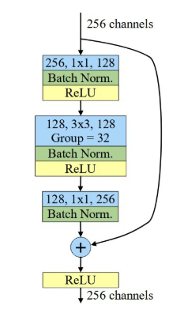

# MobileNetV2 분석 및 이해

- 핵심 아이디어
    1. **Inverted Residual with Linear Bottleneck** 구조 제안
    2. **Depthwise Separable Convolution**과 결합해 연산량(FLOPs) 절감
    3. 채널 확장(expansion) → Depthwise → 채널 축소(projection) 순으로 레이어 배치

## Inverted Residual Block

- **전통적 Residual (ResNet)**:
    
    
    
1. **Bottleneck 설계**: 중간에 1×1 Conv로 채널 수를 줄였다가 복원하여 연산량 절감
2. **Skip Connection**: 입력과 출력이 같은 차원일 때 덧셈으로 연결, 깊은 네트워크에서 그레디언트 소실 방지
3. **활성화 함수**: 모든 Conv 뒤에 ReLU 적용, 출력에도 ReLU

### **Inverted Residual Block (MobileNetV2)**

1. ***Expansion (1×1 Conv)***
    - *입력 채널 M을 t×M으로 확장하여 고차원 공간으로 매핑*
    - *확장 비율 t는 일반적으로 6으로 설정*
    - *확장된 공간에서 ReLU6 활성*화로 비선형성 부여
2. **Depthwise Convolution (3×3)**
    - 각 채널별로 개별적인 3×3 필터 적용
    - 필터 수가 채널 수와 동일하므로 연산량 절감
    - 스트라이드 설정: 다운샘플링 시 스트라이드 2 사용 가능
3. **Projection (1×1 Conv)**
    - t×M 채널을 다시 N 채널로 축소
    - 이 단계에서 **활성화 함수를 제거**하여 **Linear Bottleneck** 구현
4. **Skip Connection**
    - 입력과 출력 차원(M == N) 및 스트라이드가 1일 때만 적용
    - 잔차 연결로 그레디언트 흐름 개선

### **Linear Bottleneck이란?**

- 마지막 1×1 Conv 뒤에 **ReLU/Relu6 같은 비선형 활성화 함수를 제거**
    - 비선형 활성화는 정보(특히 저차원 공간에서)의 일부를 잘라낼 수 있음
    - “병목(Bottleneck)” 구간에서는 **선형 변환**만으로 중요한 특징을 보존하면서 채널을 압축해야 함

## 아키텍처

## 연산량(FLOPs) 및 파라미터 수

- **전체 모델 연산량**: 약 300M FLOPs (ImageNet classification)
- **파라미터 수**: 약 3.4M
- **비교**:
    - MobileNetV1: 569M FLOPs / 4.2M params
    - ResNet-50: 3.8G FLOPs / 25.6M params